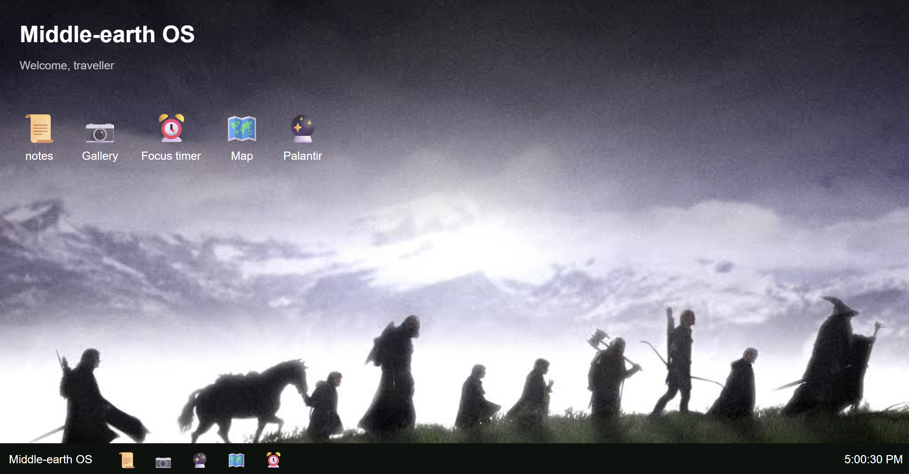

#  Middle-earth OS

A simple web-based operating system inspired by the world of Middle-earth.

##  About

Middle-earth OS is a browser based operating system inspired by the world of the Lord of the Rings. I built it with HTML, CSS and JS (I became pretty confident with these 3 after completing the personal site mission)
Ship #1 focused on fulfilling the basic requirements only (I did not jump into making it exceptional in the first ship itself, I wanted to build the foundation first). It has draggable and resizable windows, a taskbar, time display at the bottom. Also has 3 simple apps: Notes, Timer and Gallery.
So far, it’s super basic. I’m developing this in multiple ships adding smth new each time. You can already see I have two other apps in the working(Map and Palantir). I will definitely make it more polished visually and technically. (Ship #2 will have more lotr themed apps and more unique features (ive already thought of a few amazing ones)). The goal is to turn this simple OS into a fully immersive one.

# Features

Currently has 3 functioning apps: Notes (with delete, clear and view saved functions), Timer(the user can select the number of minutes and seconds) and Gallery (has a few images you can click through).
In the working: Maps (an interactive map of Middle-earth) and Palantir (inspired by the crystal ball from the movie, I plan on making it show the weather or smth unique, currently working on the crystal ball's design part).
Its windows are draggable and resizable as well. Clicking on one window brings it to the front. I plan to make it better by adding minimise and full screen options too.

## Ship 2

Future version will definitely have more advanced Middle-earth-themed features and apps. You can see that apps like Map and Palantir are in development.  They will be added and made working by the next ship. It will also be more visually appealing (I learned a lot about CSS and JS during the personal site mission and I'll be using what I learnt over here as well). 

