# Wanderlust OS

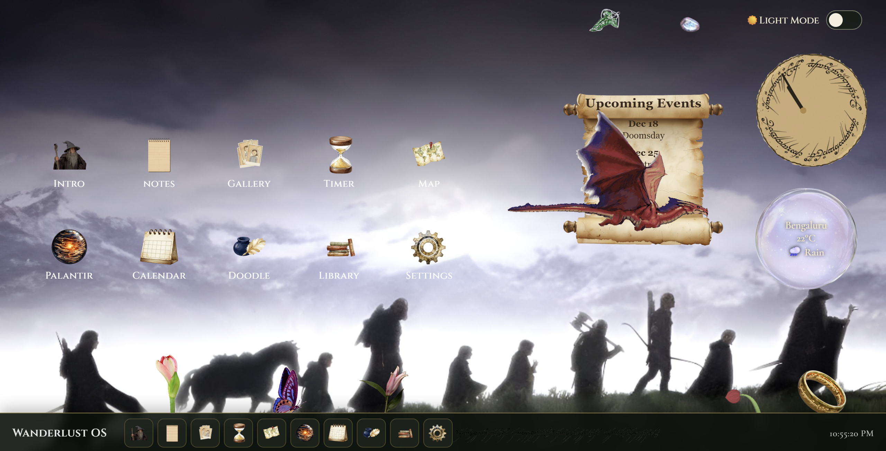

Wanderlust OS is my Middle-earth-themed web OS project. I'm a huge fan of the Lord of the Rings universe and I wanted to make something that felt like a little world of its own and giving the user an immersive experience. Of course, people who have no idea about lord of the rings can use it tooo!! I would appreciate all feedback and would like to improve the experience as much as possible for anyone who comes across the site.

## The idea

I started with the basic idea of making a web desktop where different apps could open in their own windows also with draggable and resizable windows. I basically focused on functionality first (this was Ship #1).
From there, I slowly added more things to make it feel like an actual operating system: a more proper taskbar, nicer app icons, settings, a custom cursor, different modes (light and dark), animations, and eventually lots of little hidden details.
The project changed quite a bit while I was making it. I originally focused on getting the basic apps working, and then gradually started adding more of the Middle-earth theme around them. You can see the evolution of my website through my devlogs here: https://stardance.hackclub.com/projects/58676
I'm surprised how far I've come as well 😅.

## The apps

The main apps (includes the intro window) I built are:

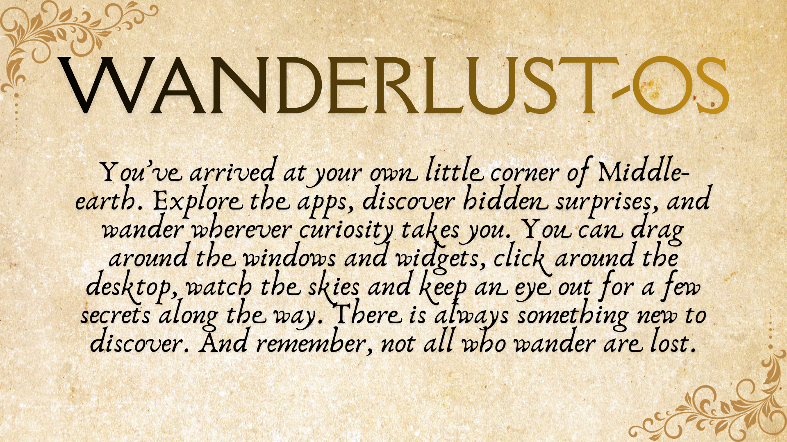
- **Intro** — a small introduction to the OS
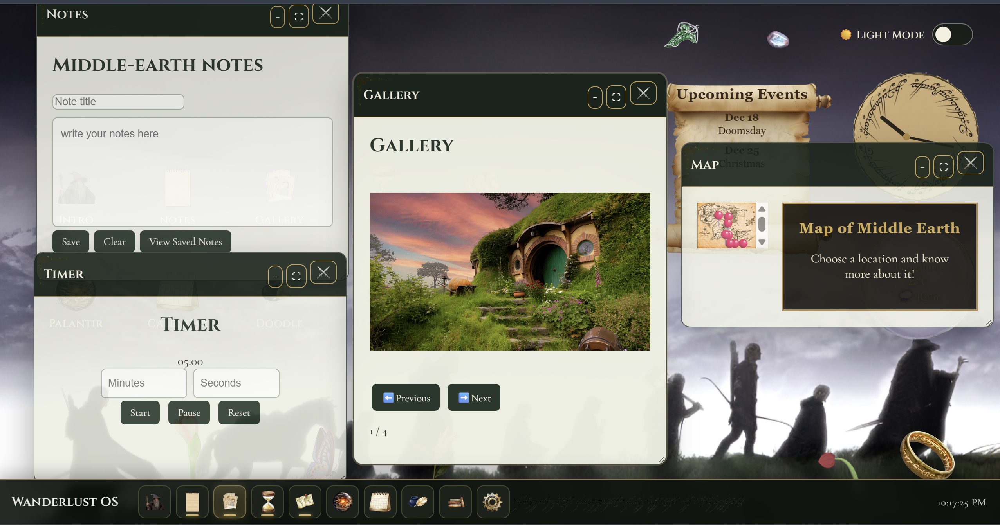
- **Notes** — a simple place to write and save notes. You can view them later as well.
- **Gallery** — for browsing images (they're image stills from the actual movie)
- **Timer** — a countdown timer.You can choose the number of minutes and seconds and a small gif plays when the timer is running.
- **Map** — an interactive map of Middle-earth with clickable locations. On clicking the pins on the map, you can get some information about that place.
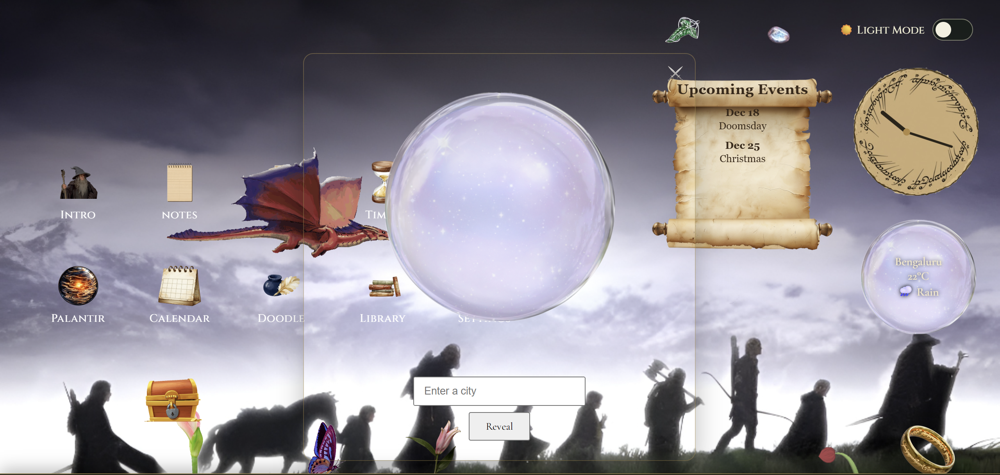
- **Palantír** — searches for a location and shows its current weather with some special effects. I thought a crystal ball would be cool because it usually predicts an event so I felt like it would be a great addition for my OS.
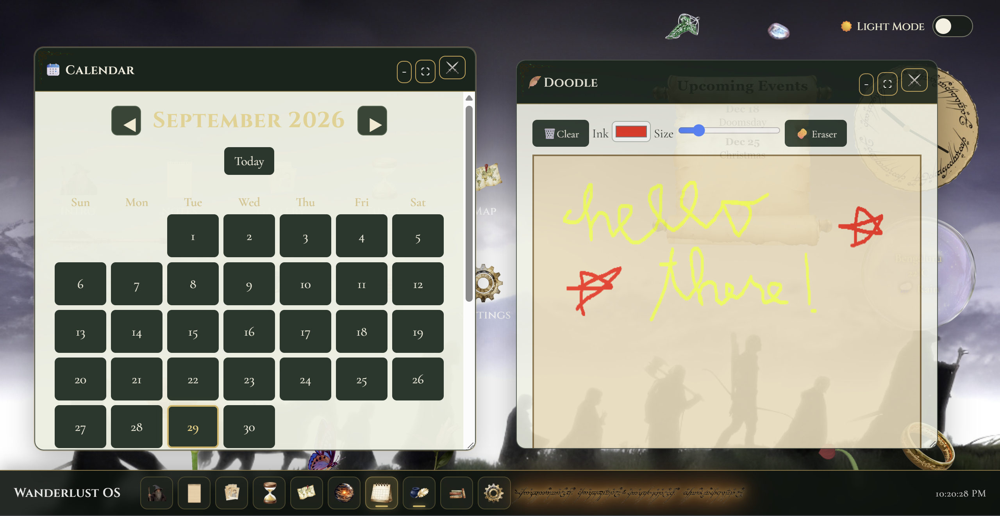
- **Calendar** — lets you browse through months and select dates and add events.
- **Doodle** — a little drawing app with eraser, colour picker and size changer.
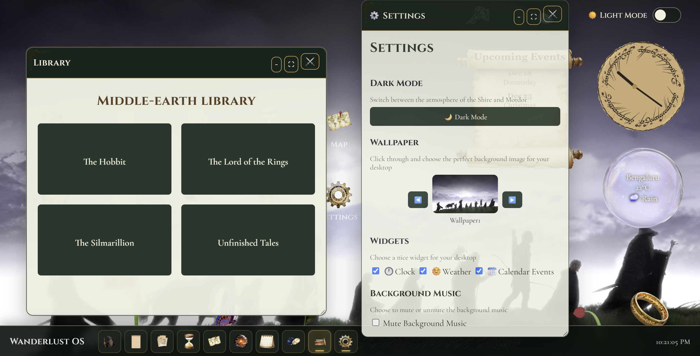
- **Library** — contains Middle-earth books (by THE J.R.R. Tolkien ofc) that can be opened inside the OS. You just click 'read an excerpt' and the pdf viewer opens.
- **Settings** — you can choose things like Light/Dark Mode, wallpapers, widgets and whether you want to mute the music.

## Main Features

I built the WebOS using the following:

- HTML
- CSS
- JavaScript
- HTML Canvas
- Local Storage
- Open-Meteo for the weather feature

I built the project gradually rather than trying to make everything at once.

First I focused on getting the desktop and windows working. Then I worked on the individual apps. Once the basic functionality was there, I started adding the visual details — borders, parchment, ancient-vibe colours, animations and lotr-inspired elements.

One of the things I spent a lot of time on was making the windows feel more like an actual desktop. They can be dragged around, resized, minimized, maximized and brought to the front when selected.
I also added a taskbar that shows which apps are open and which one is currently active.

Other features that make the OS more alive are the dragon and the arrow. Both fly across the desktop time to time. There is a custom cursor with a lil sparkle effect and a glowing inscription on the taskbar (inspired by the movie)

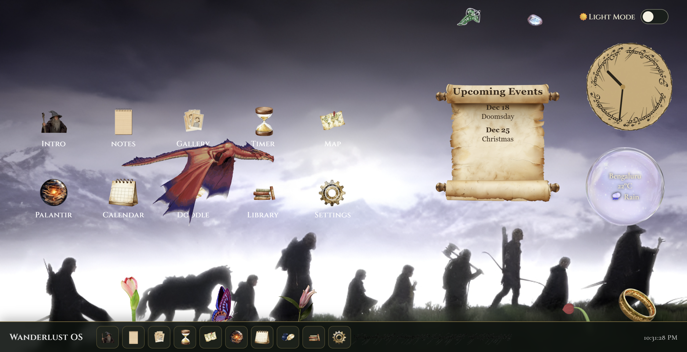

## Light Mode

The light mode is the opening mode of the OS. It has some happy music playing in the bg (Concerning Hobbits theme from the movie).

There are several interactive features around this place, including:

- The One Ring (clicking it reveals a famous quote from the movie)
- Flowers
- Butterfly
- Elvenleaf
- Arkenstone

## Dark Mode

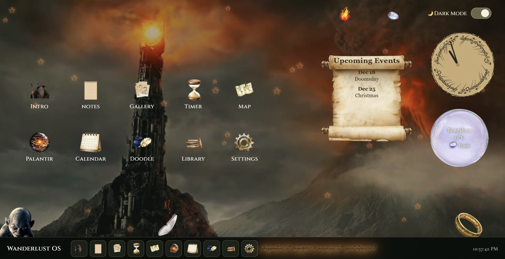

Dark Mode (in my opinion) is one of the best parts of the project. Instead of just changing the colours of the page, I wanted it to feel like the OS was entering a completely different atmosphere. The music becomes ominous, the flowers all disappear and the bg is Mordor where evil grows......

I also introduced things like:

- The One Ring
- Stars
- Gollum
- Moth
- Fire
- Arkenstone

The stars also react when the cursor gets close to them, which was one of the small interactions I added to make the desktop feel more alive (I had added something like this in my personal site mission I kinda customized it for this OS as well).

Some of these appear automatically while others require clicking or interacting with different parts of the desktop.

## Your Journey

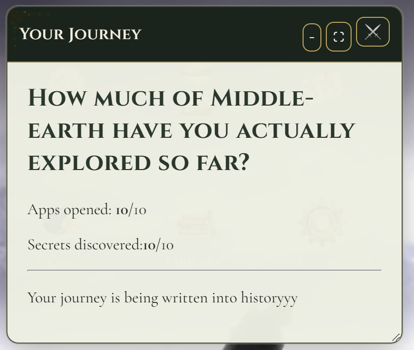

I also added a small **Your Journey** system.

It keeps track of how many apps have been opened and how many secrets have been discovered.

This uses `localStorage`, so the progress can stay saved in the browser instead of disappearing every time the page is refreshed.

I added it as a way for the user to know how many easter eggs they had found out.

## The design process

For the visual style, I wanted something simple to use yet very visually appealing. I didn't make something only lotr fans can use. Only the theme and some app names are inspired by the fantasy world. The apps are all familiar and easy to use but with a little touch of some magic. ╰(*°▽°*)╯

A lot of the design came from experimenting and changing things when they didn't feel right. I didn't have the whole final design planned from the beginning, it developed as I built the project. For example, this is what the widgets area looked like before (I pulled this image from one of my devlogs)

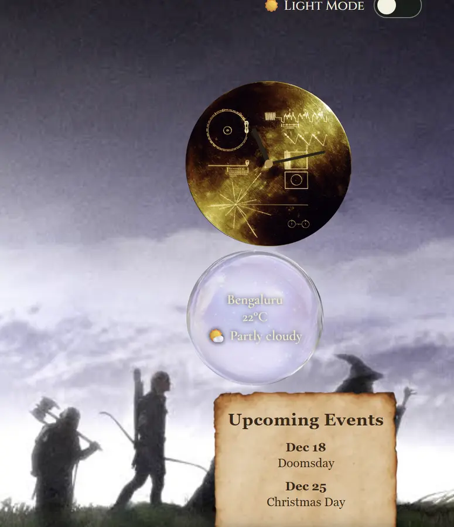

....and this is what is looks like now

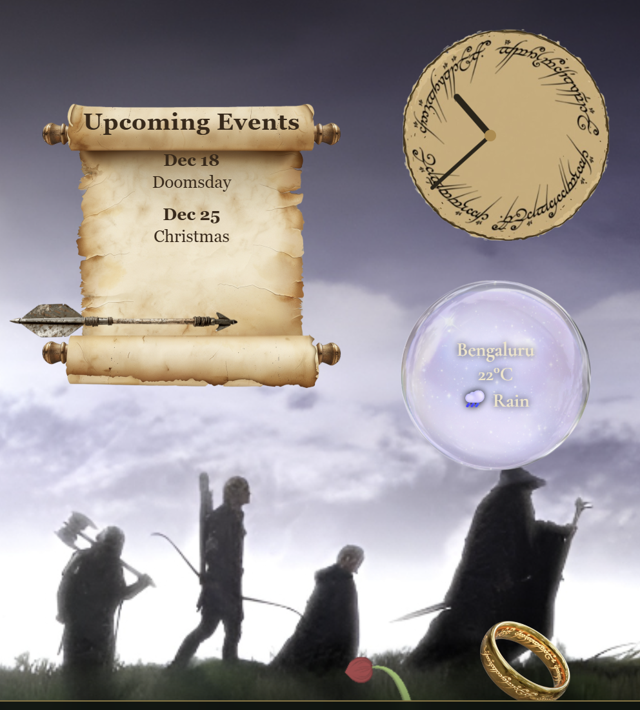

## Credits

- dragon flying gif: https://tr.pinterest.com/pin/835980749618854694/
- arrow: https://png.pngtree.com/png-clipart/20240701/original/pngtree-old-arrows-png-image_15461105.png
- cursor: https://sweezy-cursors.com/tags/lotr/
- ring: https://upload.wikimedia.org/wikipedia/commons/d/d4/One_Ring_Blender_Render.png?utm_source=en.wikipedia.org&utm_campaign=index&utm_content=original
- Gollum: https://static.wikia.nocookie.net/villainous-benchmark/images/4/48/GollumAUJTextlessPoster.webp/revision/latest?cb=20220926201914
- Flower1:https://i.pinimg.com/originals/57/95/d3/5795d3a6a1e3ad4f80fce24074f350ab.gif
- Flower2:https://i.pinimg.com/originals/05/8d/70/058d707c3bbc9472f7104c3cb6714d77.gif
- Flower3: https://tenor.com/en-GB/view/flowers-flower-growth-gardening-garden-gif-24244565
- Map: https://www.printables.com/model/603163-map-of-middle-earth-hueforge
- smoke: https://i.pinimg.com/originals/7c/6f/a2/7c6fa263e000ae7d2a5c7550b215ffc3.gif
- fire:https://i10.glitter-graphics.org/pub/729/729470quxqp5d7da.gif
- treasure:https://cdn.dribbble.com/userupload/41847526/file/original-2635a670b5da92819be8b638cdb82c27.gif
- leaves: https://encrypted-tbn0.gstatic.com/images?q=tbn:ANd9GcQ8g0zRH3cse12eGzVtLIo55lLJtBrn91ghIQzKS6tSSQ&s=10
- wallpapers: Stills from the actual movie
- Everything else: Canva

I followed a lot of tutorials from youtube and websites. Initially I went through a few amazing projects published to the WebOS mission on the Stardance Challenge to take some inspo but realised I wanted to create something that felt more like me. And I have!! I have come a long way from being an intermediate in JS (some school-level knowledge) and a complete beginner in HTML and CSS to being able to work on smth myself that's unique. 

This project was made for the Stardance Challenge organised by Hack Club! 
